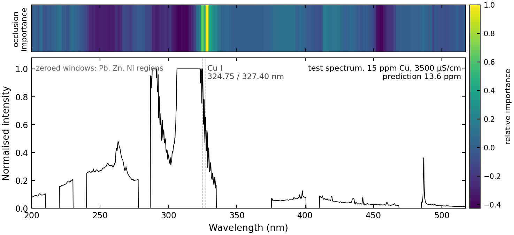
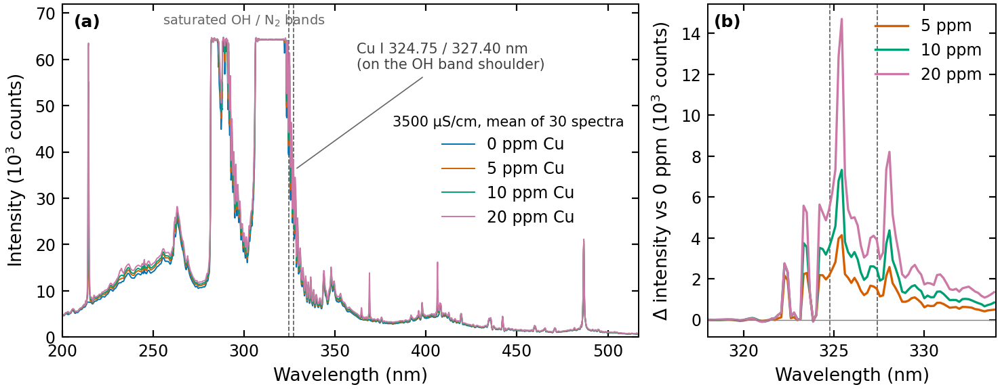
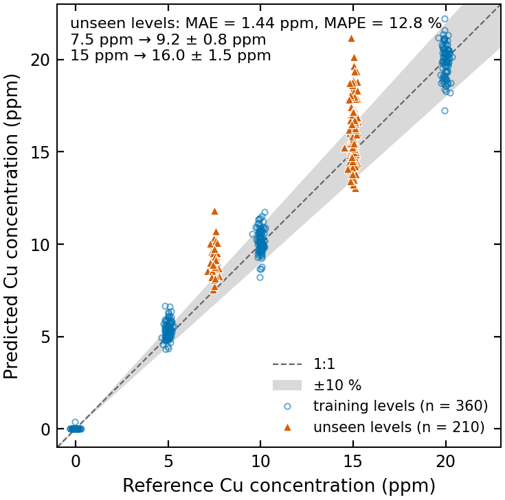

# Plasma Spectroscopy for Heavy Metal Quantification

[](https://github.com/liangyuchen-research/plasma-spectroscopy-quantification/actions/workflows/checks.yml)

Machine learning that reads dissolved-metal concentrations (Cu, Ni, Pb, Zn) directly from the optical emission spectrum of a plasma in liquid. Dense, 1-D convolutional and convolutional-Transformer regressors are compared, interpreted with spectral occlusion analysis, and evaluated on separately collected solutions and industrial wastewater.

Developed at the Plasma Engineering Laboratory, National Taiwan University (advisor: Prof. Cheng-Che Hsu). Published as:

> L.-Y. Chen, C.-Y. Wang, C.-C. Hsu, *Machine learning-based system for online quantitative monitoring of heavy metals across different aqueous matrices using spectroscopy of plasmas in liquids*, **Talanta** 297 (2026) 128652. [doi:10.1016/j.talanta.2025.128652](https://doi.org/10.1016/j.talanta.2025.128652)

The companion [spectral-restoration repository](https://github.com/liangyuchen-research/conditional-gan-spectral-restoration) covers GAN-based restoration of interfered spectra before quantification.

## What the model learns



*Sliding-window occlusion importance (top strip) for the archived convolutional Transformer, evaluated on a 15 ppm Cu test spectrum. The prediction depends almost exclusively on the Cu I 324.75 / 327.40 nm doublet, which sits on the shoulder of the saturated OH band. Produced by `scripts/make_figures.py` from files in this repository.*

<p align="center">
  
  
</p>

*Left: mean spectra at 0–20 ppm Cu (3500 µS/cm) and the concentration-dependent signal after subtracting the 0 ppm mean. Right: archived Transformer checkpoint on the recollected dataset — 360 training spectra at 0/5/10/20 ppm and 210 test spectra at the unseen 7.5 and 15 ppm levels across five conductivities: MAE 1.44 ppm, MAPE 12.8 %. These numbers are recomputed here from the shipped checkpoint and CSV files; the paper reports the full evaluation.*

## Research components

| Component | Where |
| --- | --- |
| Spectral regression — ANN, 1-D CNN and convolutional Transformer in TensorFlow/Keras, SMAPE loss, early stopping | `notebooks/baselines/` |
| Model interpretation — sliding-window occlusion over wavelength (with Grad-CAM and SHAP for copper) | `notebooks/explainability/` |
| Matrix robustness — recollected solutions at five conductivities and spiked industrial wastewater | `notebooks/wastewater/` |
| Classical baseline — multivariate linear calibration from conductivity and characteristic-line intensities | `scripts/multivariate_regression.py` |
| Figures for this page | `scripts/make_figures.py` |

## Quick start

Python 3.10–3.12. The calibration baseline and the figure script need only the analysis requirements; the notebooks need TensorFlow 2.16.2 with legacy Keras.

```bash
python -m venv .venv && source .venv/bin/activate      # .venv\Scripts\activate on Windows
python -m pip install -r requirements-analysis.txt
python scripts/validate_repository.py                  # structure, notebook syntax, data hashes
python scripts/multivariate_regression.py              # classical baseline on the included data

python -m pip install -r requirements.txt              # TensorFlow + legacy Keras
python scripts/check_models.py --notebooks             # loads the checkpoints, runs each notebook to its first optimizer step
python scripts/make_figures.py                         # regenerates docs/figures/
python -m jupyterlab                                   # open a notebook and run its configuration cell first
```

Set `MPLBACKEND=Agg` for headless runs. Some notebooks are configured for tens of thousands of epochs; review the training settings before starting a run.

## Repository guide

| Location | Contents |
| --- | --- |
| `notebooks/` | 15 experiment notebooks (outputs cleared; see the [notebook catalog](docs/notebooks.json)) |
| `scripts/` | Calibration baseline, dataset inspection, checkpoint/notebook checks, figure generation |
| `data/spectra/` | Spectral tables: 1,862 wavelength columns (`18:1880`), metadata and per-line features |
| `data/regression/` | Observations for the classical calibration |
| `artifacts/` | Three Keras checkpoints (`Cu_ANN`, `Cu_CNN`, `Cu_Transfer`) and nine training histories |
| `docs/` | [Reproduction guide](docs/reproduction.md), [data inventory](docs/data-inventory.json), [provenance ledger](docs/provenance.json) |

`TCT` in the source is the original identifier of the convolutional Transformer (`Temporal_Convolutional_Transformer`); `ORSFE` is the original name of the occlusion analysis.

## Data and reproducibility notes

- The standard training/testing tables (720 and 600 rows) are unions of the long- and short-duration tables and must not be counted as independent observations.
- Several original experiments monitored the testing set during training; interpret their recorded metrics under that protocol. The recollected dataset used for the parity plot above has fully unseen concentration levels.
- `Cu_Transfer.h5` gives consistent predictions under the wastewater-notebook preprocessing (recollected data, Pb/Zn/Ni windows zeroed, clip and divide by 60,000) and is the checkpoint used for the figures. The `Cu_ANN` and `Cu_CNN` checkpoints load and predict, but the exact acquisition they were trained on is not part of this snapshot, so they are not plotted.
- Full training, and the complete SHAP/Grad-CAM analyses, have not been rerun for this public copy. The [reproduction guide](docs/reproduction.md) lists every source correction made while preparing it.

## Citation

```bibtex
@article{chen2026plasma,
  title   = {Machine learning-based system for online quantitative monitoring of heavy metals across different aqueous matrices using spectroscopy of plasmas in liquids},
  author  = {Chen, Liang-Yu and Wang, Ching-Yuan and Hsu, Cheng-Che},
  journal = {Talanta},
  volume  = {297},
  pages   = {128652},
  year    = {2026},
  doi     = {10.1016/j.talanta.2025.128652}
}
```

## Data and code use

The spectral data and checkpoints are provided so that the published analysis can be inspected and re-run; contact the repository owner for reuse beyond that or for additional acquisitions. Third-party dependencies retain their own licenses.
